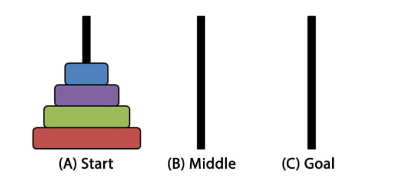

# Torres de Hanoi
## Repositorio
- Link: https://github.com/mgonzalz/eda2_torreshanoi.git
- Usuario: @mgonzalz
## Enunciado
Las Torres de Hanoi es un juego o rompecabezas clásico que consta de tres varillas y una
serie de discos de diversos diámetros que pueden deslizarse sobre cualquier varilla. El
rompecabezas comienza con los discos apilados en una varilla en orden de tamaño
decreciente, el más pequeño en la parte superior, aproximando así una forma cónica. El
objetivo del rompecabezas es mover toda la pila a la última varilla, obedeciendo las
siguientes reglas:  
- Solo se puede mover un disco a la vez.
- Cada movimiento consiste en tomar el disco superior de una de las pilas y colocarlo
en la parte superior de otra pila o en una varilla vacía.
- No se puede colocar un disco sobre otro disco que sea más pequeño que él.

En este ejercicio, se pide que se modele e implemente una solución al problema usando el
TDA de la pila (LIFO). Se debe programar las clases necesarias para dicha estructura y por
separado una función que devuelva la lista de movimientos óptima (aquella que resuelve el
problema en el mínimo número de pasos). 

### Parte 1: Fichero pilaHanoi.py
1. Define las clases de nodoPila y Pila con los atributos correspondientes.
2. Define los métodos de clase push()(apilar), pop() (desapilar) y __ str__()
(método especial para imprimir el contenido de la pila).

### Parte 2: Fichero main.py
1. Importa la estructura de la pila del fichero previamente definido.
2. Define una función getTablero(n), que recibe el número de discos en juego y
devuelve una tupla con las tres pilas en su estado inicial. Los discos se modelarán
con su tamaño, es decir, si se tiene que n=5, el contenido de la primera pila será
[1,2,3,4,5], siendo 1 el disco en la cima de la pila.
3. Usando la función anterior, inicializa un tablero de tamaño 5 e imprime el contenido
de sus respectivas pilas.
4. Define una función solve(tablero,...) que reciba el tablero recientemente
definido y devuelva la lista de movimientos para la solución óptima (la función puede
y debe recibir más parámetros). En el proceso se debe además modificar el
contenido de las pilas. 
Los movimientos vienen dados por cadenas de texto con el siguiente formato: 
“D2 from T1 to T3” -> Disco 2 de la torre 1 a la torre 3 
“D5 from T2 to T1” -> Disco 5 de la torre 2 a la torre 1 
5. Por último, llama a la función e imprime la lista de movimientos y el contenido de las
pilas al final del problema.

